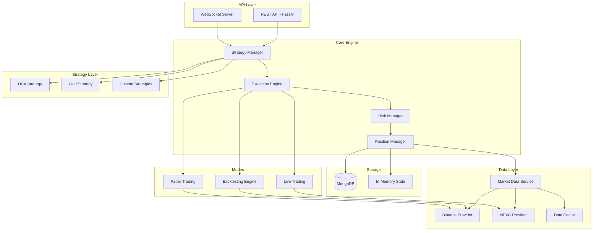
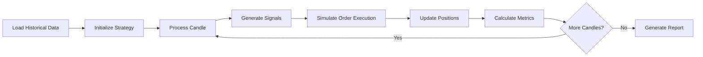
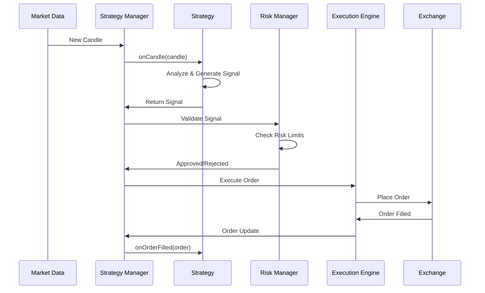

# Crypto Trading Bot - Architecture Overview

## Project Vision

A versatile, high-performance crypto trading bot built with TypeScript and Fastify that supports:
- Multiple parallel trading strategies (DCA, Grid, Custom)
- Paper trading and accurate backtesting
- Live trading on MEXC exchange
- Comprehensive risk management
- Real-time monitoring via WebSocket
- Deployment on Railway with MongoDB

## Core Design Principles

1. **Strategy Agnostic**: Core engine should support any strategy implementation
2. **Exchange Agnostic**: Abstract exchange interactions for easy multi-exchange support
3. **Mode Separation**: Clear separation between backtesting, paper trading, and live trading
4. **Accurate Backtesting**: Use real historical data with realistic order execution simulation
5. **Parallel Execution**: Multiple strategies run independently without interference
6. **Comprehensive Risk Management**: Built-in safety mechanisms at multiple levels

## High-Level Architecture



## System Components

### 1. API Layer

#### REST API (Fastify)
- **Strategy Management**
  - Create/Update/Delete strategies
  - Start/Stop/Pause strategies
  - Configure strategy parameters
  
- **Portfolio Management**
  - View current positions
  - View trade history
  - View performance metrics
  
- **Backtesting**
  - Run backtest with historical data
  - View backtest results
  - Compare strategy performance
  
- **Risk Management**
  - Configure global risk parameters
  - Set per-strategy limits
  - Emergency stop all strategies

#### WebSocket Server
- Real-time trade execution updates
- Position changes
- Portfolio value updates
- Strategy status changes
- Market data streams (optional)

### 2. Core Engine

#### Strategy Manager
- Orchestrates multiple strategies running in parallel
- Manages strategy lifecycle (start, stop, pause, resume)
- Handles strategy configuration and state persistence
- Coordinates between strategies and execution engine

#### Execution Engine
- Routes orders based on mode (backtest/paper/live)
- Handles order placement, cancellation, modification
- Simulates order execution for backtesting/paper trading
- Manages order state and fills

#### Risk Manager
- **Global Risk Controls**
  - Maximum total exposure
  - Maximum drawdown limits
  - Daily loss limits
  - Position concentration limits
  
- **Per-Strategy Risk Controls**
  - Stop-loss enforcement
  - Take-profit enforcement
  - Position sizing validation
  - Maximum positions per strategy
  
- **Pre-Trade Validation**
  - Sufficient balance checks
  - Risk limit checks
  - Position size validation

#### Position Manager
- Tracks all open positions across strategies
- Calculates unrealized P&L
- Manages position lifecycle
- Handles position updates from fills

### 3. Data Layer

#### Market Data Service
- Unified interface for market data
- Handles data provider switching (Binance for backtest, MEXC for live)
- Caches frequently accessed data
- Provides historical and real-time data

#### Exchange Providers
- **Binance Provider**: Historical data for backtesting
- **MEXC Provider**: Live trading execution
- Abstract interface for easy addition of new exchanges

#### Data Cache
- In-memory caching of recent candles
- Reduces API calls
- Improves backtesting performance

### 4. Strategy Layer

#### Base Strategy Interface
All strategies implement a common interface:

```typescript
interface IStrategy {
  id: string;
  name: string;
  symbol: string;
  timeframe: string;
  
  // Lifecycle methods
  initialize(): Promise<void>;
  onCandle(candle: Candle): Promise<Signal[]>;
  onOrderFilled(order: Order): Promise<void>;
  onOrderCancelled(order: Order): Promise<void>;
  
  // State management
  getState(): StrategyState;
  setState(state: StrategyState): void;
  
  // Risk parameters
  getRiskParams(): RiskParameters;
}
```

#### Built-in Strategies

**DCA (Dollar Cost Averaging)**
- Regular interval buying
- Configurable investment amount
- Optional take-profit levels
- Averaging down on dips

**Grid Trading**
- Define price range and grid levels
- Buy at lower grids, sell at upper grids
- Configurable grid spacing
- Profit from ranging markets

**Custom Strategies**
- Plugin system for user-defined strategies
- Access to technical indicators
- Full control over entry/exit logic

### 5. Backtesting Engine

#### Key Features
- **Accurate Simulation**
  - Uses real historical OHLCV data
  - Simulates realistic order fills
  - Accounts for slippage and fees
  - Respects order types (market, limit)
  
- **Performance Metrics**
  - Total return
  - Sharpe ratio
  - Maximum drawdown
  - Win rate
  - Average trade duration
  - Profit factor
  
- **No External Dependencies**
  - Runs completely offline
  - No MongoDB required
  - No Railway connection needed
  - Fast execution

#### Backtesting Process



### 6. Storage Layer

#### MongoDB (Production Only)
- Strategy configurations
- Trade history
- Performance metrics
- User settings
- Audit logs

#### In-Memory State (All Modes)
- Current positions
- Active orders
- Recent market data
- Strategy runtime state

**Note**: Backtesting uses only in-memory storage for speed and independence.

## Data Models

### Strategy Configuration
```typescript
interface StrategyConfig {
  id: string;
  name: string;
  type: 'dca' | 'grid' | 'custom';
  symbol: string;
  timeframe: '5m' | '15m' | '30m' | '1h' | '4h' | '1d';
  mode: 'backtest' | 'paper' | 'live';
  
  // Strategy-specific parameters
  parameters: Record<string, any>;
  
  // Risk management
  riskParams: {
    stopLossPercent?: number;
    takeProfitPercent?: number;
    maxPositionSize: number;
    maxOpenPositions: number;
    maxDrawdownPercent: number;
  };
  
  // Status
  status: 'active' | 'paused' | 'stopped';
  createdAt: Date;
  updatedAt: Date;
}
```

### Position
```typescript
interface Position {
  id: string;
  strategyId: string;
  symbol: string;
  side: 'long' | 'short';
  entryPrice: number;
  currentPrice: number;
  quantity: number;
  unrealizedPnL: number;
  realizedPnL: number;
  stopLoss?: number;
  takeProfit?: number;
  openedAt: Date;
  closedAt?: Date;
}
```

### Order
```typescript
interface Order {
  id: string;
  strategyId: string;
  symbol: string;
  side: 'buy' | 'sell';
  type: 'market' | 'limit';
  quantity: number;
  price?: number;
  status: 'pending' | 'filled' | 'cancelled' | 'rejected';
  filledQuantity: number;
  averageFillPrice: number;
  createdAt: Date;
  filledAt?: Date;
}
```

### Trade
```typescript
interface Trade {
  id: string;
  strategyId: string;
  positionId: string;
  symbol: string;
  side: 'buy' | 'sell';
  quantity: number;
  price: number;
  fee: number;
  pnl: number;
  timestamp: Date;
}
```

## Technology Stack

### Core
- **Runtime**: Node.js (v20+)
- **Language**: TypeScript (v5+)
- **Framework**: Fastify (v4+)
- **WebSocket**: @fastify/websocket

### Data & Storage
- **Database**: MongoDB (production)
- **ODM**: Mongoose
- **Caching**: In-memory (Map/Set)

### Exchange Integration
- **Binance**: binance-api-node or ccxt
- **MEXC**: ccxt or custom REST client

### Technical Analysis
- **Indicators**: technicalindicators or tulind
- **Custom calculations**: Built-in utilities

### Testing
- **Unit Tests**: Vitest
- **Integration Tests**: Vitest + Supertest
- **E2E Tests**: Vitest

### Development
- **Build**: tsx for development, tsc for production
- **Linting**: ESLint
- **Formatting**: Prettier
- **Process Manager**: PM2 (production)

### Deployment
- **Platform**: Railway
- **Database**: MongoDB (Railway container)
- **Environment**: Docker-ready

## Project Structure

```
trading-bot-v2/
├── src/
│   ├── api/
│   │   ├── routes/
│   │   │   ├── strategies.ts
│   │   │   ├── positions.ts
│   │   │   ├── trades.ts
│   │   │   ├── backtest.ts
│   │   │   └── health.ts
│   │   ├── websocket/
│   │   │   └── handlers.ts
│   │   └── server.ts
│   │
│   ├── core/
│   │   ├── strategy-manager.ts
│   │   ├── execution-engine.ts
│   │   ├── risk-manager.ts
│   │   └── position-manager.ts
│   │
│   ├── strategies/
│   │   ├── base/
│   │   │   └── strategy.interface.ts
│   │   ├── dca/
│   │   │   └── dca-strategy.ts
│   │   ├── grid/
│   │   │   └── grid-strategy.ts
│   │   └── custom/
│   │       └── custom-strategy.ts
│   │
│   ├── data/
│   │   ├── providers/
│   │   │   ├── base-provider.ts
│   │   │   ├── binance-provider.ts
│   │   │   └── mexc-provider.ts
│   │   ├── market-data.service.ts
│   │   └── cache.service.ts
│   │
│   ├── backtesting/
│   │   ├── backtest-engine.ts
│   │   ├── order-simulator.ts
│   │   ├── metrics-calculator.ts
│   │   └── report-generator.ts
│   │
│   ├── models/
│   │   ├── strategy.model.ts
│   │   ├── position.model.ts
│   │   ├── order.model.ts
│   │   └── trade.model.ts
│   │
│   ├── types/
│   │   ├── strategy.types.ts
│   │   ├── market.types.ts
│   │   ├── order.types.ts
│   │   └── common.types.ts
│   │
│   ├── utils/
│   │   ├── indicators.ts
│   │   ├── calculations.ts
│   │   ├── logger.ts
│   │   └── validators.ts
│   │
│   ├── config/
│   │   ├── database.ts
│   │   ├── exchanges.ts
│   │   └── app.ts
│   │
│   └── index.ts
│
├── tests/
│   ├── unit/
│   ├── integration/
│   └── e2e/
│
├── plans/
│   └── architecture-overview.md
│
├── .env.example
├── .gitignore
├── package.json
├── tsconfig.json
├── Dockerfile
└── README.md
```

## Key Implementation Details

### 1. Strategy Execution Flow



### 2. Backtesting Accuracy

To ensure accurate backtesting:

1. **Realistic Order Fills**
   - Market orders: Fill at next candle's open price
   - Limit orders: Fill only if price reaches limit within candle range
   - Account for slippage based on order size

2. **Fee Calculation**
   - Apply exchange-specific fee structure
   - Consider maker/taker fees
   - Include funding rates for futures (if applicable)

3. **Data Integrity**
   - Use actual historical OHLCV data
   - Handle missing data appropriately
   - Respect candle timing

4. **No Look-Ahead Bias**
   - Strategies only see data up to current candle
   - Indicators calculated with available data only
   - Orders placed can only execute on future candles

### 3. Parallel Strategy Execution

Strategies run independently:
- Each strategy has its own event loop
- Shared resources (market data, risk limits) are thread-safe
- Position conflicts are prevented by risk manager
- Each strategy maintains its own state

### 4. Risk Management Layers

**Layer 1: Pre-Trade Validation**
- Check if order violates risk limits
- Validate position sizing
- Ensure sufficient balance

**Layer 2: Position Monitoring**
- Continuously monitor open positions
- Trigger stop-loss/take-profit
- Track drawdown

**Layer 3: Global Limits**
- Total exposure across all strategies
- Daily loss limits
- Emergency shutdown triggers

### 5. Mode Switching

The system supports three modes with minimal code changes:

```typescript
enum TradingMode {
  BACKTEST = 'backtest',
  PAPER = 'paper',
  LIVE = 'live'
}

// Execution engine routes to appropriate handler
class ExecutionEngine {
  async executeOrder(order: Order, mode: TradingMode) {
    switch (mode) {
      case TradingMode.BACKTEST:
        return this.backtestExecutor.execute(order);
      case TradingMode.PAPER:
        return this.paperExecutor.execute(order);
      case TradingMode.LIVE:
        return this.liveExecutor.execute(order);
    }
  }
}
```

## Configuration Management

### Environment Variables
```env
# Server
NODE_ENV=development
PORT=3000
HOST=0.0.0.0

# MongoDB (not required for backtesting)
MONGODB_URI=mongodb://localhost:27017/trading-bot

# Exchanges
BINANCE_API_KEY=
BINANCE_API_SECRET=

MEXC_API_KEY=
MEXC_API_SECRET=

# Risk Management
MAX_TOTAL_EXPOSURE=10000
MAX_DAILY_LOSS=500
MAX_DRAWDOWN_PERCENT=20

# Logging
LOG_LEVEL=info
```

### Strategy Configuration Files
Strategies can be configured via JSON/YAML files or API:

```json
{
  "name": "BTC DCA Strategy",
  "type": "dca",
  "symbol": "BTC/USDT",
  "timeframe": "15m",
  "mode": "paper",
  "parameters": {
    "investmentAmount": 100,
    "interval": "daily",
    "takeProfitPercent": 10
  },
  "riskParams": {
    "stopLossPercent": 5,
    "maxPositionSize": 1000,
    "maxOpenPositions": 3
  }
}
```

## Performance Considerations

1. **Efficient Data Handling**
   - Cache frequently accessed market data
   - Use streaming for large historical datasets
   - Implement pagination for API responses

2. **Concurrent Processing**
   - Use worker threads for CPU-intensive calculations
   - Parallel strategy execution
   - Async/await for I/O operations

3. **Memory Management**
   - Limit in-memory candle history
   - Implement data cleanup for old records
   - Use generators for large datasets

4. **Database Optimization**
   - Index frequently queried fields
   - Use aggregation pipelines
   - Implement connection pooling

## Security Considerations

1. **API Key Management**
   - Store keys in environment variables
   - Never commit keys to version control
   - Use Railway secrets in production

2. **API Authentication**
   - Implement JWT authentication
   - Rate limiting on endpoints
   - Input validation and sanitization

3. **Risk Controls**
   - Hard limits on position sizes
   - Emergency stop mechanism
   - Audit logging of all trades

## Monitoring & Observability

1. **Logging**
   - Structured logging (JSON format)
   - Different log levels (debug, info, warn, error)
   - Log rotation and retention

2. **Metrics**
   - Strategy performance metrics
   - System health metrics
   - API response times

3. **Alerts**
   - Risk limit breaches
   - System errors
   - Unusual trading activity

## Future Enhancements

1. **Advanced Features**
   - Machine learning strategy support
   - Multi-exchange arbitrage
   - Social trading / copy trading
   - Advanced charting and visualization

2. **Scalability**
   - Microservices architecture
   - Message queue for order processing
   - Distributed backtesting

3. **User Experience**
   - Web dashboard
   - Mobile app
   - Telegram bot integration

## Success Criteria

The system will be considered successful when:

1. ✅ Multiple strategies can run in parallel without interference
2. ✅ Backtesting produces accurate, reproducible results
3. ✅ Paper trading simulates live trading realistically
4. ✅ Live trading executes orders reliably on MEXC
5. ✅ Risk management prevents catastrophic losses
6. ✅ System is performant and responsive
7. ✅ Code is maintainable and well-documented
8. ✅ Deployment to Railway is straightforward

## Next Steps

See the detailed implementation plan in the todo list.
