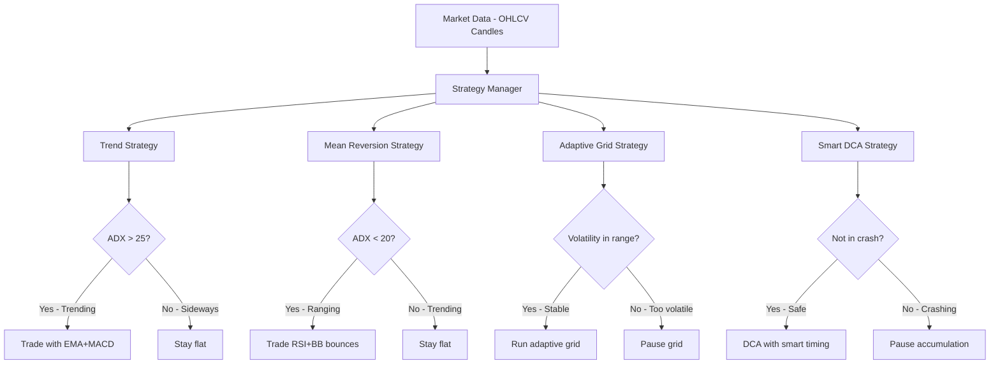

# Strategy Improvement Plan

## Executive Summary

The current 4 strategies have fundamental issues resulting in poor performance:
- **SMA Crossover**: avg PnL -$157.90, 26% win rate → **REPLACE**
- **RSI+BB**: avg PnL +$0.93, 28% win rate → **SIGNIFICANTLY IMPROVE**
- **Grid**: 0 trades (never triggered) → **REPLACE**
- **DCA**: avg PnL -$260, 35% win rate → **IMPROVE**

The plan is to create a **strategy ensemble** where each strategy specializes in one market condition, with built-in regime filters so they only trade when conditions are favorable.

---

## Architecture: Strategy Ensemble



Each strategy has a **built-in regime filter** so they naturally avoid conflicting with each other.

---

## Strategy 1: RSI+BB Mean Reversion — IMPROVE FIRST (Best Performer)

### Current Issues
1. **Fake ATR** — approximates high/low as `close * 1.01/0.99` despite `Candle` having real OHLC data
2. **Exits too early** — sells at middle BB, capturing only ~50% of the reversion move
3. **RSI exit threshold too low** — exits at RSI 60 (barely above neutral)
4. **Trend filter is backwards** — `currentPrice < smaValue` means it buys in downtrends, contradicting the optimized config comment
5. **No volume confirmation** — enters purely on price indicators
6. **No ADX regime filter** — trades in trending markets where mean reversion fails

### Improvements
| Change | Before | After | Why |
|--------|--------|-------|-----|
| ATR calculation | Fake `close * 1.01` | Real ATR from OHLC candle data | Accurate volatility-based stops |
| Store OHLC history | Only close prices | Full OHLC arrays | Needed for proper ATR, volume analysis |
| Buy exit target | Middle BB | Upper BB or RSI > 70 | Capture full reversion move |
| RSI exit threshold | `rsiOverbought - 10` = 60 | Configurable, default 70 | Dont exit too early |
| Trend filter | `price < SMA` = buy in downtrends | `price > SMA` = buy in uptrends | Mean reversion works better buying dips in uptrends |
| Volume confirmation | None | Volume > 1.5x average on entry | Confirms institutional interest at oversold levels |
| ADX regime filter | None | Only trade when ADX < 25 | Avoid trending markets where MR fails |
| Partial take profit | All-or-nothing exit | 50% at middle BB, 50% at upper BB | Lock in profits while letting winners run |
| Dynamic stop loss | Fixed % or fake ATR | Real ATR * 2 below entry | Adapts to current volatility |
| Cooldown period | None | Min 3 candles between trades | Avoid rapid-fire losing trades |

### New Entry Conditions
```
BUY when ALL of:
  1. ADX < 25 (not trending — regime filter)
  2. RSI < rsiOversold (default 30)
  3. Price <= lower Bollinger Band
  4. Volume > 1.5x 20-period average volume
  5. Price dropped >= minDropPercent from 10-candle high
  6. Confirmation: conditions held for N candles
  7. Optional: Price > SMA200 (uptrend filter)
```

### New Exit Conditions
```
SELL HALF when ANY of:
  1. Price reaches middle Bollinger Band
  2. RSI > 55

SELL ALL when ANY of:
  1. Price reaches upper Bollinger Band
  2. RSI > rsiOverbought (default 70)
  3. Trailing stop hit (ATR-based)
  4. Stop loss hit (2x ATR below entry)
  5. Max hold period reached
```

### Files to Modify
- `src/strategies/mean-reversion/rsi-bb-strategy.ts` — main strategy logic
- `src/types/strategy.types.ts` — add `adxThreshold`, `volumeMultiplier`, `cooldownCandles` to `MeanReversionParams`

---

## Strategy 2: EMA+MACD+ADX Trend Strategy — REPLACE SMA Crossover

### Why Replace (Not Improve)
The SMA Crossover has too many fundamental issues to fix incrementally:
- SMA is inherently lagging; EMA responds faster
- Single indicator (SMA cross) has no confirmation
- No trend strength measurement
- The `priceBelowFastSMA` exit kills trades on minor pullbacks

### New Strategy Design: Multi-Indicator Trend Following

**Indicators Used:**
- **EMA 12/26** — faster trend detection than SMA
- **MACD** — momentum confirmation (signal line crossover + histogram)
- **ADX** — trend strength filter (only trade when ADX > 25)
- **ATR** — dynamic stop loss and take profit sizing
- **Volume** — confirm breakouts with above-average volume

### Entry Conditions
```
BUY when ALL of:
  1. ADX > 25 (strong trend — regime filter)
  2. +DI > -DI (bullish directional movement)
  3. EMA 12 > EMA 26 (short-term trend up)
  4. MACD line > Signal line (momentum confirmation)
  5. MACD histogram increasing (momentum accelerating)
  6. Price > EMA 50 (medium-term trend confirmation)
  7. Volume > 1.2x 20-period average
```

### Exit Conditions
```
SELL when ANY of:
  1. MACD line crosses below Signal line (momentum reversal)
  2. ADX drops below 20 (trend weakening)
  3. Trailing stop hit (3x ATR below highest price since entry)
  4. Stop loss hit (2x ATR below entry price)
  5. Price closes below EMA 26 for 2 consecutive candles
  6. Max hold period reached
```

### Key Differences from Old SMA Crossover
| Aspect | Old SMA Crossover | New Trend Strategy |
|--------|-------------------|-------------------|
| Trend detection | SMA 9/21 cross | EMA 12/26 + EMA 50 |
| Confirmation | Price above both SMAs | MACD + ADX + Volume |
| Trend strength | None | ADX > 25 required |
| Stop loss | Fixed % | Dynamic ATR-based |
| Take profit | Hardcoded 8% | Trailing stop (3x ATR) |
| Exit trigger | Price below fast SMA | MACD reversal or ADX weakening |
| Whipsaw protection | None | ADX filter + confirmation candles |

### Files to Create/Modify
- `src/strategies/trend/ema-macd-adx-strategy.ts` — **NEW FILE** (replace sma-crossover)
- `src/types/strategy.types.ts` — add `TrendStrategyParams` interface
- `src/types/common.types.ts` — keep `trend-following` type
- `src/strategies/strategy-factory.ts` — update factory to use new class

### Decision: Keep or Delete Old SMA Crossover?
- Keep `sma-crossover-strategy.ts` as a reference/fallback
- The factory will point `trend-following` type to the new `EMAMACDADXStrategy`

---

## Strategy 3: Adaptive Grid Strategy — REPLACE Grid

### Why Replace
The current grid strategy has critical design flaws:
- Static price range that doesnt adapt
- No stop loss protection
- Buys at ALL lower grids simultaneously
- `centerOnPrice` param in config isnt implemented

### New Strategy Design: Adaptive Grid

**Key Improvements:**
- **Auto-centers** on current price using ATR for grid spacing
- **Dynamic grid recalculation** when price moves outside range
- **Only buys at nearest grid level** (not all at once)
- **Stop loss** below the lowest grid level
- **Volatility filter** — pauses when ATR is too high (breakout likely)
- **ADX filter** — only runs when ADX < 20 (ranging market)

### Grid Calculation
```
Grid center = Current price
Grid spacing = ATR * gridSpacingMultiplier (default 0.5)
Upper bound = center + (gridLevels/2 * spacing)
Lower bound = center - (gridLevels/2 * spacing)

Recenter when price moves > 2 grid spacings from center
```

### Entry/Exit Logic
```
For each grid level:
  BUY when price drops to grid level AND:
    - ADX < 20 (ranging market)
    - ATR < threshold (not too volatile)
    - No more than maxPositionsPerSide open
    
  SELL when price rises to next grid level above buy
  
  STOP LOSS: Close all positions if price drops below lowest grid - 1 ATR
```

### Files to Create/Modify
- `src/strategies/grid/adaptive-grid-strategy.ts` — **NEW FILE**
- `src/types/strategy.types.ts` — update `GridStrategyParams`
- `src/strategies/strategy-factory.ts` — update factory

---

## Strategy 4: Smart DCA — IMPROVE

### Current Issues
1. Buys on schedule regardless of market conditions
2. Take profit resets everything, losing cost basis
3. No awareness of trends or crashes

### Improvements
| Change | Before | After | Why |
|--------|--------|-------|-----|
| Market awareness | None | Check RSI + SMA200 before buying | Avoid buying into crashes |
| Crash detection | None | Pause if price < SMA200 AND RSI < 25 | Dont catch falling knives |
| Take profit | Sell 100%, reset | Sell 50% at target, keep rest | Maintain position for further upside |
| Dip buying | Fixed averageDownPercent | Scale buys: 1x at -5%, 1.5x at -10%, 2x at -15% | Buy more at better prices |
| Trailing take profit | None | After hitting TP, use trailing stop | Let winners run |
| Max investment cap | None | Stop buying after maxTotalInvestment | Prevent overexposure |

### New Buy Logic
```
Regular DCA buy when ALL of:
  1. Interval has elapsed
  2. NOT in crash mode (price > SMA200 * 0.9 OR RSI > 30)
  3. Total invested < maxTotalInvestment

Dip buy (average down) when:
  1. Price dropped averageDownPercent from average entry
  2. RSI < 40 (showing oversold conditions)
  3. Scale: multiply investmentAmount by (1 + dropPercent/10)
```

### New Sell Logic
```
Partial sell (50%) when:
  1. Profit >= takeProfitPercent

Trailing stop on remaining 50%:
  1. Trail at 2% below highest price since partial sell
  
Full sell when:
  1. Trailing stop hit on remaining position
  2. OR price drops below SMA200 AND RSI < 25 (crash exit)
```

### Files to Modify
- `src/strategies/dca/dca-strategy.ts` — update logic
- `src/types/strategy.types.ts` — add crash detection params to `DCAStrategyParams`

---

## Implementation Order

We do this **1 by 1**, backtesting each before moving to the next:

1. **RSI+BB Mean Reversion** — best current performer, fix bugs and add filters
2. **EMA+MACD+ADX Trend** — replace the worst performer (SMA Crossover)
3. **Adaptive Grid** — replace the non-functional grid
4. **Smart DCA** — improve the accumulation strategy

After each strategy is improved, we:
- Run backtests on multiple time periods
- Compare with old strategy performance
- Tune parameters if needed
- Move to the next strategy

---

## Shared Utilities Needed

Before starting individual strategies, we need a shared indicator utility:

### `src/utils/indicators.ts` — NEW FILE
```typescript
// Centralized indicator calculations using real OHLC data
// - calculateATR(candles, period) — real ATR from high/low/close
// - calculateADX(candles, period) — ADX with +DI/-DI
// - calculateVolumeMA(candles, period) — average volume
// - isVolumeSpike(candles, period, multiplier) — volume confirmation
```

This avoids duplicating indicator logic across strategies and ensures all strategies use proper OHLC-based calculations.

---

## Risk Considerations

- Each strategy should risk no more than **5-10% of capital per trade**
- Combined exposure across all strategies should not exceed **30% of total capital**
- Each strategy has its own **max drawdown circuit breaker** (pause if drawdown > 15%)
- The strategy manager already supports pausing individual strategies

---

## Expected Outcomes

| Strategy | Current Avg PnL | Target Avg PnL | Current Win Rate | Target Win Rate |
|----------|----------------|----------------|-----------------|----------------|
| RSI+BB | +$0.93 | +$50-100 | 28% | 45-55% |
| Trend (new) | -$157.90 | +$30-80 | 26% | 35-45% |
| Grid (new) | $0 (no trades) | +$20-50 | 0% | 55-65% |
| DCA | -$260 | +$10-30 | 35% | 50-60% |

These are conservative targets. The key improvement is **not losing money** — going from negative to positive PnL is the primary goal.
